# Week 00 - Introduction to ML
Date: `04-08-2026`

## Overview

We kicked off the bootcamp with an orientation session, team introductions, and a discussion on transitioning from Software Engineering to AI/ML. We also set up our GitHub repo, learned about branching workflows, commits, and PR processes.

## Key Concepts

**Intelligence** is the ability to learn, reason, solve problems, think abstractly, and adapt to new situations. There are three main types:
- Linguistic (NLP)
- Logical-Mathematical (Symbolic AI)
- Spatial (Computer Vision).

**Artificial Intelligence (AI)** is the discipline of building intelligent systems that can learn and adapt from experience without being explicitly programmed.

**Deterministic vs Probabilistic Relationships:** In deterministic systems, we have y = f(x). In probabilistic systems, there's uncertainty: y = f(x) + noise.

**Known vs Unknown Functions:** Sometimes we know the function (like a temperature alarm triggering at 100°C), but often we don't (like identifying humans in images). Machine Learning helps us estimate unknown functions from data.

> **Machine Learning (ML)** is a set of algorithms that learn patterns from data. The core of learning involves three components:
- A decision process
- An error function to measure mistakes
- An optimization process to improve

**Traditional Programming vs Machine Learning:** 
- Traditional: Data + Program → Computation → Results
- ML: Data + Results → Computation → Program (we infer the program from examples)

**Sub-domains of ML:**
- Supervised Learning
- Unsupervised Learning
- Semi-supervised Learning
- Reinforcement Learning

**Artificial Neural Networks (ANNs)** are tools inspired by biological neurons with multiple layers of connected units. They provide non-linear modeling power. When networks have more than 3 hidden layers, they're considered Deep Neural Networks (examples: ResNet50, LLMs, custom CNNs).

## What I Learnt

- Learning in ML is fundamentally about approximation.
- We use Exploratory Data Analysis (EDA) to identify which patterns and algorithms might work best for our data.
- Training is the optimization process that refines our model parameters to minimize errors.
- The key insight is that ML doesn't require hard-coding rules but rather lets algorithms discover patterns from examples.

### AI and ML Landscape

Here's how different fields and approaches fit together within AI:

```mermaid
flowchart TB

    AI["Artificial Intelligence (AI)"]

    %% AI branches
    AI --> ML["Machine Learning (ML)"]
    AI --> NLP["Natural Language Processing (NLP)"]
    AI --> Vision["Computer Vision"]
    AI --> Speech["Speech Recognition"]
    AI --> Expert["Expert Systems"]
    AI --> Robotics["Robotics"]
    AI --> Planning["Planning"]
    AI --> Search["Search Algorithms"]
    AI --> Knowledge["Knowledge Representation & Reasoning"]
    AI --> Rule["Rule-Based Systems"]
    AI --> Games["Game Playing"]

    %% Machine Learning
    ML --> Classical["Classical Machine Learning"]
    ML --> NN["Neural Networks"]
    ML --> DL["Deep Learning"]

    %% Classical ML
    Classical --> LR["Linear Regression"]
    Classical --> LogR["Logistic Regression"]
    Classical --> SVM["Support Vector Machines (SVM)"]
    Classical --> RF["Random Forest"]
    Classical --> GP["Gaussian Process Regression"]
    Classical --> KMeans["K-Means Clustering"]

    %% Neural Networks
    NN --> MLP["MLP"]
    NN --> CNN["CNN"]
    NN --> RNN["RNN"]
    NN --> LSTM["LSTM"]
    NN --> RBFN["RBF Network"]
    NN --> Autoencoders["Autoencoders"]
    NN --> GAN["GAN"]

    %% Deep Learning
    DL --> DeepNN["Deep Neural Networks"]
    DL --> CNN
    DL --> RNN
    DL --> LSTM
    DL --> GAN
    DL --> Autoencoders

    %% Generative AI
    DL --> GenAI["Generative AI (GenAI)"]
    GenAI --> LLM["Large Language Models (LLMs)"]

    %% Examples / applications
    LLM --> TextGen["Text Generation"]
    LLM --> CodeGen["Code Generation"]
    LLM --> Conversational["Conversational AI"]

    GenAI --> ImageGen["Image Generation"]
    GenAI --> AudioGen["Audio / Speech Generation"]
    GenAI --> VideoGen["Video Generation"]

    %% Styling
    classDef ai fill:#b7cba9,stroke:#4f6f44,stroke-width:2px,color:#000;
    classDef ml fill:#c9dcf5,stroke:#5b7fb5,stroke-width:2px,color:#000;
    classDef classical fill:#e8edf5,stroke:#718096,stroke-width:1.5px,color:#000;
    classDef neural fill:#e5d8e8,stroke:#8b6795,stroke-width:2px,color:#000;
    classDef deep fill:#fff0c7,stroke:#d6a72c,stroke-width:2px,color:#000;
    classDef gen fill:#ffe1b8,stroke:#d98b19,stroke-width:2px,color:#000;
    classDef llm fill:#f7c9c9,stroke:#c45c5c,stroke-width:2px,color:#000;

    class AI ai;
    class ML ml;
    class Classical,LR,LogR,SVM,RF,GP,KMeans classical;
    class NN,MLP,CNN,RNN,LSTM,RBFN,Autoencoders,GAN neural;
    class DL,DeepNN deep;
    class GenAI,TextGen,CodeGen,Conversational,ImageGen,AudioGen,VideoGen gen;
    class LLM llm;
```

