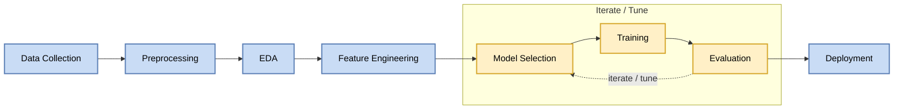
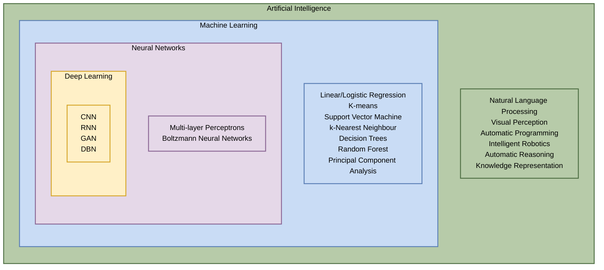
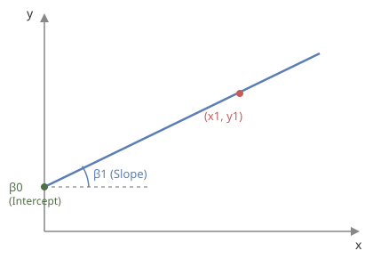

# Week 01 - ML Basics & Linear Regression
Date: `18-08-2026`

## Overview

This week we went deeper into how ML actually works under the hood, starting with where ML sits inside AI, then moving into the ML project workflow, the subdomains of ML, and finally Linear Regression: what it assumes, how errors and loss work, and what happens when we train a model with scikit-learn. We also kicked off a practical coding exercise using the Auto MPG dataset.

## Key Concepts

**Errors vs Loss:** Error is the raw difference between the actual and predicted output. Loss is a function of that error, used to turn it into a score we can actually optimise against. We try to minimise error by refining the algorithm, and zero is the lowest value loss can take. Loss keeps getting reduced (ideally) over iterations.

**The ML Project Workflow:**
Data Collection -> Preprocessing -> EDA -> Feature Engineering -> [Model Selection -> Training -> Evaluation] (iterate/tune) -> Deployment

**Subdomains of ML** (based on what kind of data we train on):
- Supervised vs unsupervised: unsupervised training data has no y values, only x.
- Semi-supervised: manually labelling data takes a lot of effort and domain knowledge, so it's costly. If we have a small amount of labelled data and a lot of unlabelled data, we go semi-supervised (e.g. labelling 10K images by hand and leaving 990K unlabelled).
- Reinforcement learning: self-driving cars, LLM tuning with RLHF, reward-based learning, transfer learning.

**Linear Regression assumptions:** we always assume the data follows a linear pattern.

$$y = \beta_1 X_1 + \beta_2 X_2 + \beta_3 X_3 + \epsilon$$

The model assumes the relationship is linear, and the question we're really asking is: what's the best hyperplane to model our data? We always start experimenting from the smallest model first, this is standard industry practice. An ANN with enough layers (a multi-layer perceptron) can in theory model any relationship in the data, but we don't jump there first.

- Simple Linear Regression: $y = mx + c$
- Multiple Linear Regression: multiple predictor variables
- X is the independent/predictor variable

## What I Learnt

### Relationship between AI, ML, NN and DL

Deep Learning is a neural network with 3 or more hidden layers. Machine learning is used to approximate or guess the unknown formula behind some data, using data that follows that formula.

### Errors vs Loss (the intuition)

In machine learning, error is the raw, physical distance between a model's prediction and the actual ground truth, whereas loss is a mathematical function that transforms that raw error into an actionable penalty score used to train the model.

We can't just sum the errors across all data points, because they'd cancel out to roughly zero (we assume errors follow a normal distribution centered at 0 with Standard Deviation of 1, the bell curve). So instead we square all the error values and average them:

- **MSE** (Mean Squared Error): square the errors, divide by the number of points
- **MAE** (Mean Absolute Error): take the absolute value of the errors instead of squaring
- **RMSE**: the square root of MSE

All of these are loss functions, they're all functions of the errors. Loss is also a function of the betas (the model parameters), so loss changes as we change the model's parameters.

The graph of Loss vs $\beta_1$ and Loss vs $\beta_0$ look similar: a curve that goes down, hits a minimum, then goes back up. In multiple linear regression, instead of a line we get a plane.

### The XY plane for Linear Regression

The line is $y = \beta_1 x + \beta_0$, where $\beta_0$ is where the line crosses the y-axis (the intercept) and $\beta_1$ is the slope. $(x_1, y_1)$ marks one data point on the line.

### What's happening when we train a LR model with scikit-learn?

When we use Linear Regression, we assume the relationship between X and Y is linear. We construct a function of the errors (the Loss Function, $L$) that tells us how incorrect our predictions are:

$$e_1 = y_1 - \hat{y}_1$$
$$e_2 = y_2 - \hat{y}_2$$

### Exploratory Data Analysis (EDA)

EDA involves uni-, bi-, and multivariate analysis, plus correlation analysis. Based on the EDA and feature engineering we do, we decide which model to use.

### Practical 1

Auto MPG dataset from Kaggle - [Notebook](notebooks/linear_regression.ipynb).

Topics to explore further:
- **Virtual environments in Python**: isolated Python environments per project, so dependencies for one project don't clash with another. Keeps package versions contained instead of installing everything globally.
- **Package managers**:
  - pip is the standard Python package installer; python here refers to using Python's built-in `venv` for environment management
  - poetry manages both dependencies and virtual environments together, using a `pyproject.toml` and a lockfile to keep installs reproducible across machines
  - uv is a newer, much faster package manager/installer that can replace pip and venv together
- **ML libraries**:
  - scikit-learn provides ready-made implementations of ML algorithms (regression, classification, clustering, etc.)
  - pandas handles tabular data (loading, cleaning, transforming datasets)
  - numpy provides fast array/matrix operations that most ML libraries are built on top of.
- **Visualization**: seaborn and matplotlib are used to plot and visually explore data, matplotlib is the lower-level plotting library, seaborn builds on top of it with nicer defaults and statistical plot types (useful for EDA).
