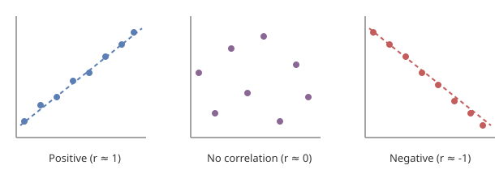

# Week 02 - Exploratory Data Analysis & Linear Regression
Date: `01-09-2026`

## Overview

This week was about Exploratory Data Analysis (EDA): variable types, univariate/bivariate/multivariate analysis, and correlation analysis, including multicollinearity and why it matters for Linear Regression. We also covered train-test splitting and touched on model training and evaluation.

## Key Concepts

**Variable types:**
- Quantitative (numeric, can be measured):
  1. Discrete: countable, whole-number values, e.g. number of children, number of cars owned
  2. Continuous: can take any value in a range, e.g. weight, height, temperature
- Qualitative (categorical, describes a quality):
  1. Ordinal: categories that have a natural order/ranking, e.g. education level (high school < bachelor's < master's), satisfaction rating (low/medium/high)
  2. Nominal: categories with no natural order, e.g. gender, blood type, country of residence

**Exploratory Data Analysis (EDA) has four parts:**
1. **Univariate analysis**: looking at one feature at a time
2. **Bivariate analysis**: looking at the relationship between two features
3. **Multivariate analysis**: looking at relationships across three or more features together
4. **Correlation analysis**: measuring how strongly features move together

`df.describe()` (or its transpose) gives a quick statistical summary of the dataset: mean, average, standard deviation, etc.

**Linear Regression assumptions:**
1. X and Y are normally distributed
2. The relationship between X and Y is linear
3. X variables (predictors) are independent of each other, i.e. no multicollinearity

**Multicollinearity:** when predictor (X) variables are correlated with each other, which breaks assumption 3 above. Some datasets have multicollinearity built in, so we use regularised regression techniques to reduce the issue:
1. Ridge
2. Lasso
3. Elastic Net

## What I Learnt

### Univariate Analysis

We plot a histogram for each feature in the dataset and check the shape of its distribution. The assumption we work with is that each feature should be roughly normally distributed.

Skewness is when a distribution has a longer tail on one side instead of being symmetric like a normal distribution:
- **Right (positive) skew:** most values are bunched up on the low end, with a tail stretching out toward higher values. The mean gets pulled above the median.
- **Left (negative) skew:** most values are bunched up on the high end, with a tail stretching out toward lower values. The mean gets pulled below the median.

Skewed features can throw off models that assume normality, so this is something to watch for and potentially transform (e.g. a log transform) before modelling.

Other plots worth exploring for a single feature:
- **Boxplot:** shows a feature's quartiles, the median as a line inside the box, and whiskers extending to 1.5x the IQR, with anything beyond that plotted as individual outlier points. Good for comparing spread and outliers across features side by side.
- **Violin plot:** a boxplot with a mirrored density curve on each side, like a smoothed-out histogram. Shows both the summary stats and the actual shape of the distribution in one plot, useful for catching a bimodal distribution that a boxplot alone would hide.

Both help spot skewness and outliers.

Since features are usually on different scales, we need to standardise them before plotting multiple features on the same diagram, otherwise the differences in scale drown out the actual shape comparison.

### Bivariate Analysis

- **Scatter plot:** plots one variable against another as raw points, used to eyeball whether a relationship exists and roughly what shape it takes (linear, curved, or no pattern at all).
- **Regression plot:** a scatter plot with a fitted line (and usually a confidence band) drawn through it, used to visualise the strength and direction of a linear relationship between two variables.

### Correlation Analysis

Pearson correlation measures the strength and direction of a linear relationship between two variables:

$$-1 \leq Corr(X, Y) \leq 1$$

- -1: strong negative correlation
- 0: no correlation
- 1: strong positive correlation

### Train-Test Split

The usual split is 70% training / 30% testing. When there's a huge volume of data (millions of rows), the split can be much more lopsided, e.g. 99% training / 1% testing, since even 1% is still plenty of test data.

Scikit-learn's `train_test_split` handles this split automatically, keeping X and its corresponding Y values perfectly aligned during the shuffle regardless of whether `random_state` is set. The `random_state` parameter matters because it makes the split reproducible, giving us the exact same train and test sets every time we run the code, instead of a different random split each run.

### Training and Evaluation

Practical 2 ([2_linear_regression.ipynb](notebooks/2_linear_regression.ipynb)) walks through fitting a Linear Regression model on the Auto MPG dataset end to end.

**Setup:** `mpg` is the target (Y), and `displacement`, `horsepower`, `weight`, `acceleration`, `model_year` are the predictors (X). After the 70/30 train-test split (`random_state=42` for reproducibility), we get 274 training rows and 118 test rows.

**Fitting the model:** `LinearRegression().fit(X_train, Y_train)` finds the betas (coefficients) that minimise the loss across the training data. `model.coef_` gives one coefficient per feature and `model.intercept_` gives $\beta_0$:

| Feature | Coefficient |
|---|---|
| displacement | -0.0011 |
| horsepower | -0.0093 |
| weight | -0.0064 |
| acceleration | 0.0650 |
| model_year | 0.7295 |

Intercept ($\beta_0$): -12.65

Each coefficient is how much `mpg` is predicted to change for a one-unit increase in that feature, holding the others constant. `model_year` has by far the largest positive coefficient, i.e. newer cars are predicted to have noticeably better mpg, while `weight` and `horsepower` pull mpg down slightly, matching the intuition that heavier, more powerful cars are less fuel-efficient.

**Predicting:** `model.predict(X_test)` applies the fitted line to the unseen test rows to get `Y_pred`, which we then compare against the real `Y_test` values.

**Evaluating with MSE, RMSE, and MAE:** all three are computed from the same errors, `Y_test - Y_pred`:
- **MSE** (10.23): average of the squared errors. Squaring stops positive and negative errors from cancelling out, but also means the units are "mpg²", which is hard to interpret directly.
- **RMSE** (3.20): the square root of MSE, which brings the units back to plain mpg. Because the errors were squared first, RMSE still penalises large errors more heavily than small ones.
- **MAE** (2.55): average of the absolute errors, in plain mpg, and treats every error proportionally rather than penalising big misses extra hard.

RMSE being noticeably higher than MAE here (3.20 vs 2.55) suggests there are a handful of predictions with larger errors pulling RMSE up, since RMSE is more sensitive to outlying errors than MAE is.
